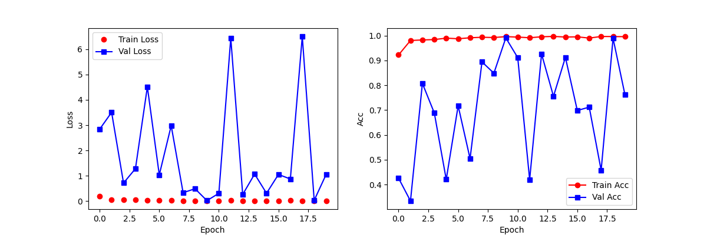

# classification-of-rice

基于 ResNet18 骨干网络的图像分类模型，在Rice-Image-Dataset数据集上训练，提供预训练权重model_best.pth。

## 数据集介绍

五类大米品种（Arborio、Basmati、Ipsala、Jasmine、Karacadag）

 Arborio

 Basmati

 Ipsala

 Jasmine

 Karacadag

## 测试结果



实际准确率在99.0%-99.5%之间

## 使用

### 安装

```bash
git clone https://github.com/AAAlsy4/classification-of-rice.git
cd ./classification-of-rice
```

下载数据集[Rice-Image-Dataset](https://pan.baidu.com/s/1hUcjG1Z34-1FHOy9Y1mX4w?pwd=42s2)

下载预训练权重(可选)[model_best.pth](https://pan.baidu.com/s/1s6ZwKulsGCNOa77650rhcg?pwd=yewf)

### 环境配置

```bash
conda env create -f environment.yml
conda activate rice
```

### 数据集预处理

划分数据集

```bash
python data_partitioning.py
```

计算均值和方差，并保存在./mean.npy和./std.npy中

```bash
python mean_std.py 
```

### 训练

```bash
python model_train.py --epochs 20 --batch_size 128 --num_workers 8 --learning_rate 0.001 --data_dir ./data/train --visualize
```

--visualize 是否将可视化结果保存为图片

### 推理

```bash
python model_test.py --data_dir ./data/test --pth_file ./model_best.pth --inference --image_path ./Arborio.jpg
```

--inference 是否进行单张图片推理

--image_path 推理图片路径

### 使用tensorboard

```bash
tensorboard --logdir ./tensorboard
```
