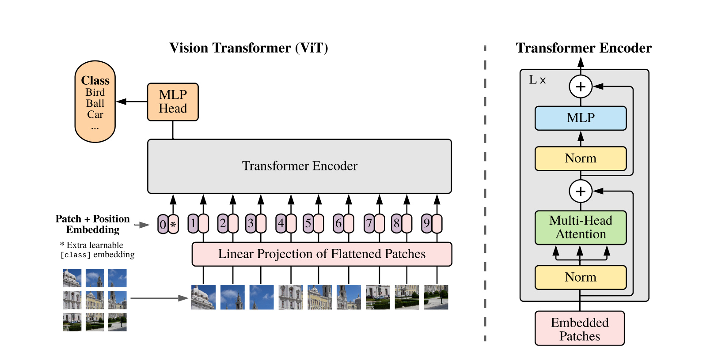
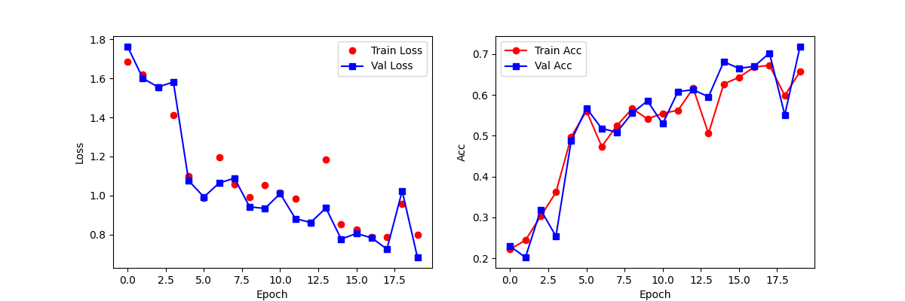

# classification-of-rice

基于 ResNet18 和 ViT 骨干网络的图像分类模型，在Rice-Image-Dataset数据集上训练。

 ViT

## 数据集介绍

五类大米品种（Arborio、Basmati、Ipsala、Jasmine、Karacadag）

 Arborio

 Basmati

 Ipsala

 Jasmine

 Karacadag

## 测试结果

训练环境：Ubuntu操作系统，GPU nvidia 3090

### ResNet


实际准确率在99.5%以上

### ViT



实际准确率在70%-75%之间

## 使用

### 安装

```bash
git clone https://github.com/AAAlsy4/classification-of-rice.git
cd ./classification-of-rice
```

下载数据集[Rice-Image-Dataset](https://pan.baidu.com/s/1hUcjG1Z34-1FHOy9Y1mX4w?pwd=42s2)

### 环境配置

```bash
conda env create -f environment.yml
conda activate rice
```

### 数据集预处理

划分数据集

```bash
python data_partitioning.py
```

计算均值和方差，并保存在./mean.npy和./std.npy中

```bash
python mean_std.py 
```

### 训练

```bash
# 训练ResNet模型
python model_train.py --model ResNet --epochs 20 --batch_size 128 --num_workers 8 --learning_rate 0.001 --data_dir ./data/train --visualize
# 训练ViT模型
python model_train.py --model ViT --epochs 20 --batch_size 128 --num_workers 8 --learning_rate 0.001 --data_dir ./data/train --visualize
```

--visualize 是否将可视化结果保存为图片

### 推理

```bash
# 验证ResNet模型
python model_test.py --model ResNet --data_dir ./data/test --pth_file ./model_best_ResNet.pth --inference --image_path ./Ipsala.jpg
# 验证ViT模型
python model_test.py --model ViT --data_dir ./data/test --pth_file ./model_best_ViT.pth --inference --image_path ./Ipsala.jpg
```

--inference 是否进行单张图片推理

--image_path 推理图片路径

### 使用tensorboard

```bash
# ResNet模型训练曲线
tensorboard --logdir ./tensorboard_ResNet
# ViT模型训练曲线
tensorboard --logdir ./tensorboard_ViT
```
